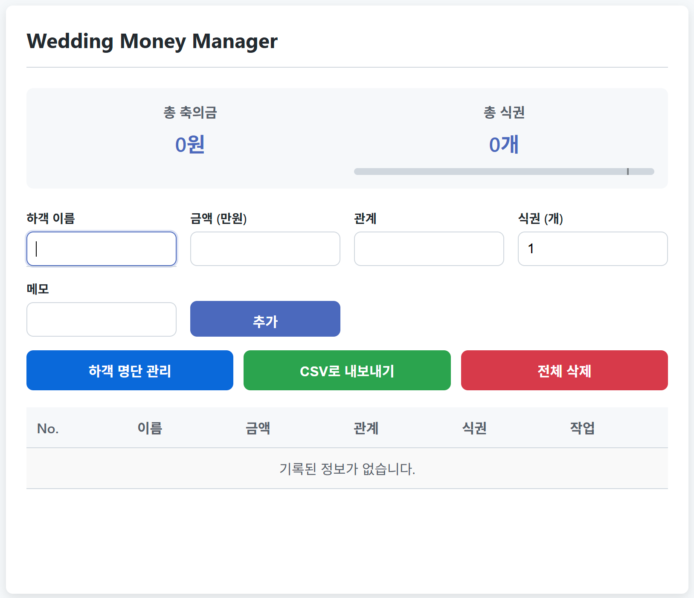

# Wedding Money Manager

결혼식, 돌잔치 등 각종 행사에서 가장 정신없는 축의금 접수대, 이제는 스마트하게 관리하세요!  
**Wedding Money Manager**는 복잡한 수기 장부 없이, 어떤 기기에서든 쉽고 빠르게 축의금을 기록하고 관리할 수 있도록 도와주는 개인용 웹 애플리케이션입니다.

**[➡️ 지금 바로 사용해보기](https://Gabeujin.github.io/wedding-money-manager/)**

 

 

### ## 🌟 주요 기능

* **✍️ 실시간 기록 및 자동 계산:** 하객 이름, 금액, 식권 수를 입력하면 총 축의금과 발급된 식권 수가 즉시 업데이트됩니다.  

* **📂 나만의 하객 명단 관리:** 자주 찾는 하객 명단을 직접 등록하거나 엑셀/JSON 파일로 불러와, 이름 입력 시 관계를 자동으로 완성할 수 있습니다.

* **🔒 완벽한 개인정보 보호:** 모든 데이터는 서버에 저장되지 않고 **오직 사용자 개인의 웹 브라우저에만 안전하게 보관**됩니다. 인터넷이 끊겨도, 창을 닫았다 열어도 데이터는 사라지지 않습니다.

* **📊 한눈에 보는 통계:** 클릭 한 번으로 총 하객 수, 평균 축의금, 최고/최저액 등 유용한 통계를 바로 확인할 수 있습니다.

* **🎫 스마트한 식권 관리:** 미리 설정한 식권 개수에 맞춰 남은 수량을 프로그레스 바로 시각화하여 재고를 쉽게 파악할 수 있습니다.

* **엑셀(CSV)로 내보내기:** 기록된 모든 내역은 언제든지 엑셀 파일로 다운로드하여 영구적으로 보관하거나 공유할 수 있습니다.

 

### ## 🚀 사용 방법

1.  **[링크](https://Gabeujin.github.io/wedding-money-manager/)에 접속**하기만 하면 바로 사용할 수 있습니다.
2.  **(선택) `[하객 명단 관리]`** 버튼을 눌러 미리 하객 정보를 등록해두면 더욱 편리합니다.
3.  행사가 끝나면 **`[CSV로 내보내기]`** 버튼을 눌러 결과를 저장하세요.

 

### ## 🔒 데이터는 안전한가요?

**네, 완벽하게 안전합니다.** 이 앱은 `localStorage`라는 웹 브라우저의 안전한 저장 공간을 사용합니다. 비유하자면, 서버라는 '공용 칠판'에 기록하는 것이 아니라, 사용자님만 열 수 있는 '개인 금고'에 데이터를 보관하는 것과 같습니다. 개발자를 포함한 그 누구도 사용자님의 데이터에 접근할 수 없으니 안심하고 사용하세요.

---
*Made with ❤️ for a special day*